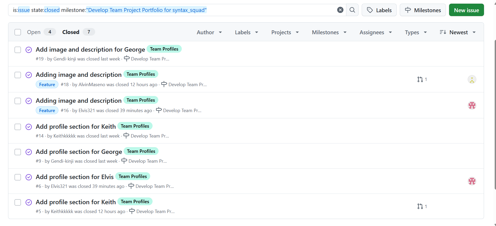
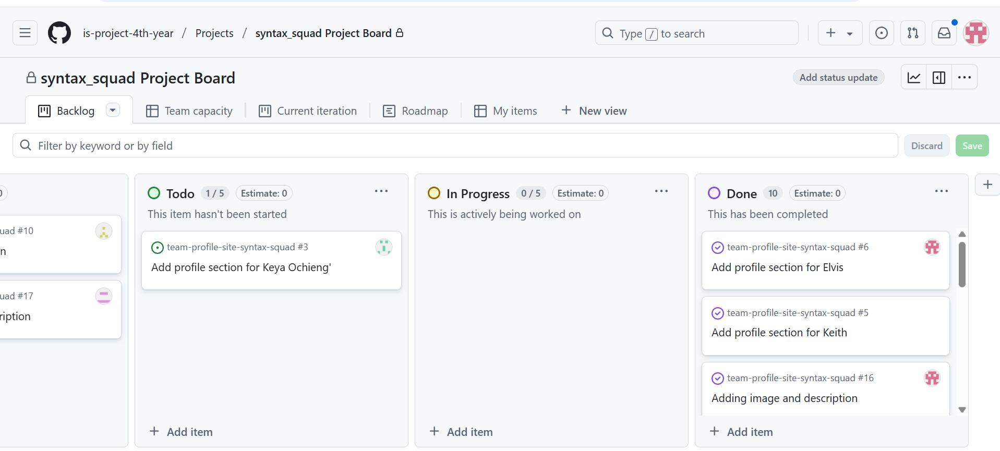
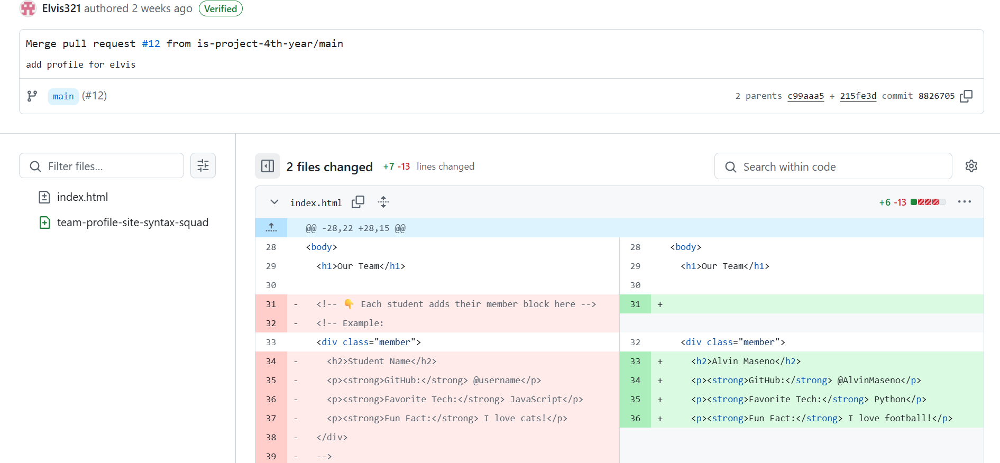

# Personal Portfolio Documentation

## 1. Student Details

- **Full Name**:
- **Admission Number**:
- **GitHub Username**:
- **Email**:

## 2. Deployed Portfolio Link

- **GitHub Pages URL**:  
  _(Provide the live link to your deployed portfolio website)_

## 3. Learnings from the Git Crash Program

Write about **4 things** you expected to learn during the Git crash course (yes, we all came in with some big hopes 😅).
For each one, mention:

What you thought it would be like **(Expectation 👀)**

What you actually learned **(Reality 😅)**

And how it helped with your personal portfolio project 💻

make it honest—and if it surprised you, even better!

Example format:

**🧠 What I Thought I'd Learn vs What I Actually Learned**
**1. Concept: Branching**

`Expectation 👀` : I thought branching was just for developers working on big apps—nothing I’d need for a small project.

`Reality 😅`: Turns out even solo devs need branches! It helped me avoid breaking my main code while testing new designs.

`Impact 💡`: I created a feature branch for my "About Me" section and merged it smoothly into the main branch after testing. Super useful!

## 4. Screenshots of Key GitHub Features

### A. Milestones and Issues

*This screenshot shows how I created milestones to organize project phases and linked related issues to track progress.*

---

### B. Project Board

*This screenshot shows the project board with columns for “To Do”, “In Progress”, and “Done” to visually track work items.*

---

### C. Branching

*This screenshot shows a list of branches with clear, meaningful names to support feature development and collaboration.*

---

### D. Pull Requests

*This screenshot shows a pull request that is properly linked to an issue, documenting the review and merge process.*

---

### E. Merge Conflict Resolution

*This screenshot shows how I resolved a merge conflict during a pull request merge, either using GitHub or a local tool.*

